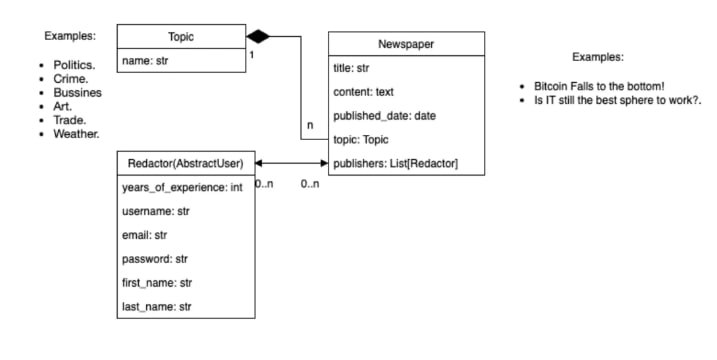
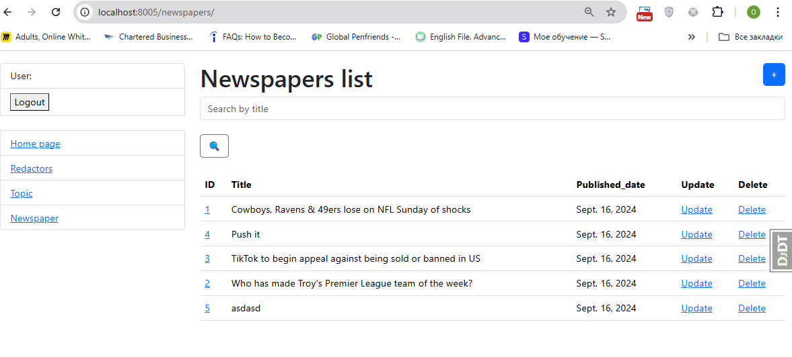
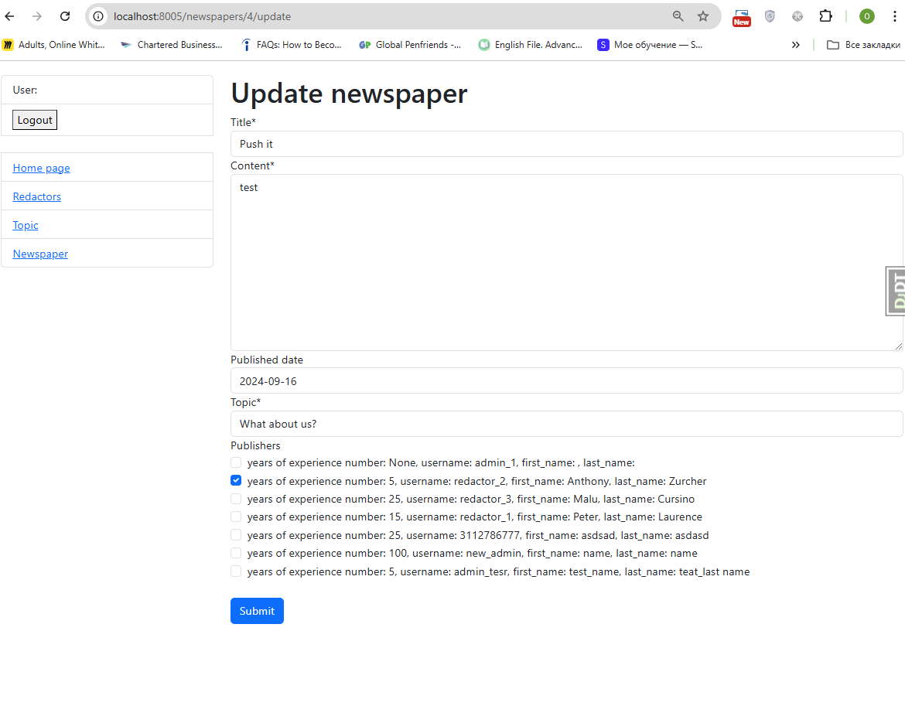
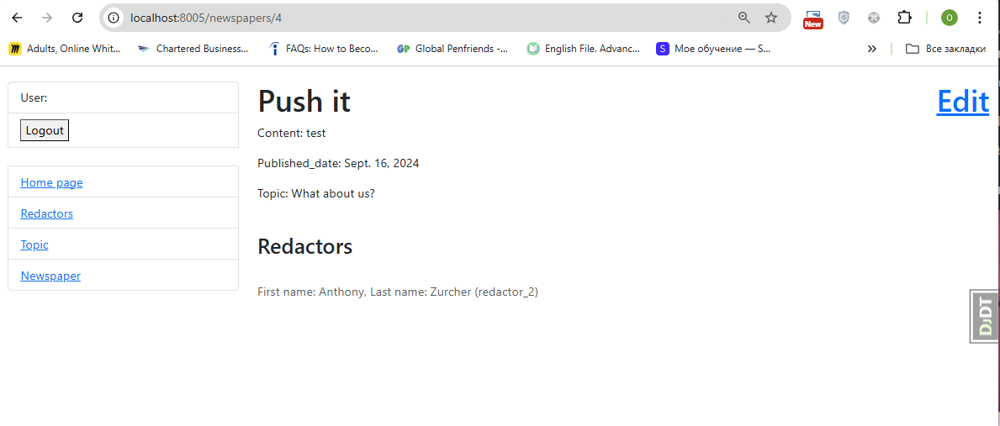
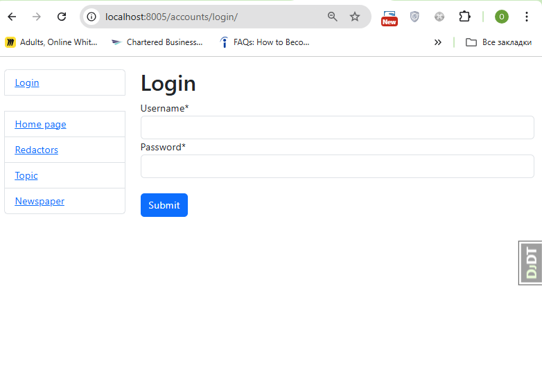

# Newspaper agency service

Newspaper agency service is a Django-based application for newspaper management.

### Getting Started

```
git clone git@github.com:oleksashcherbakov/newspaper-agency.git
cd newspaper-agency
python - m venv venv
sourse venv/bin/activate
pip install - r requiments.txt
python manage.py makemigrations
python manage.py migrate
python manage.py runserver
python manage.py createsuperuser
```

#### Architecture diagram



### Let's talk about the site's features
1. Different permissions for log in in and non-log in users 
2. Ability to add editors, newspapers, topics as many as possible
3. Possibility of having detail information about all instances
4. Validation of values that used for creating reporters
5. Ability for searching through lists of editors, newspapers, topics
6. And much more on our website  :)

####  _The opportunity to advertise with our agency is welcome, but not for everyone. Expensive and useless. Contact the admin on the last Friday of every month._


### Admin Interface
The Django admin interface is available at /admin/. You can use it to manage the database entries directly.

### Debug Toolbar
The Django Debug Toolbar is included in the project. It's automatically added to the URL patterns when in debug mode.


### Website screens





